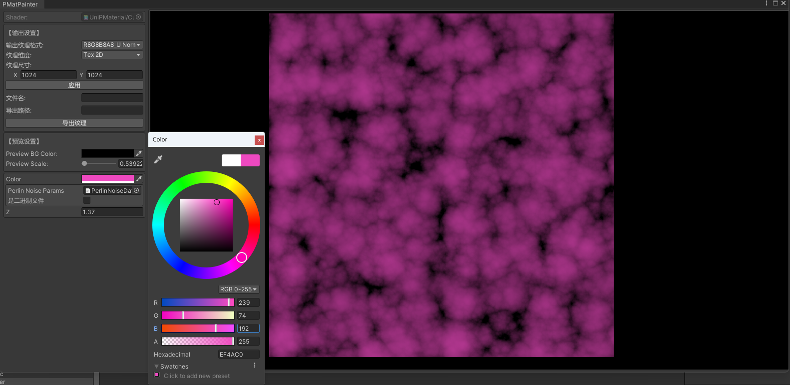
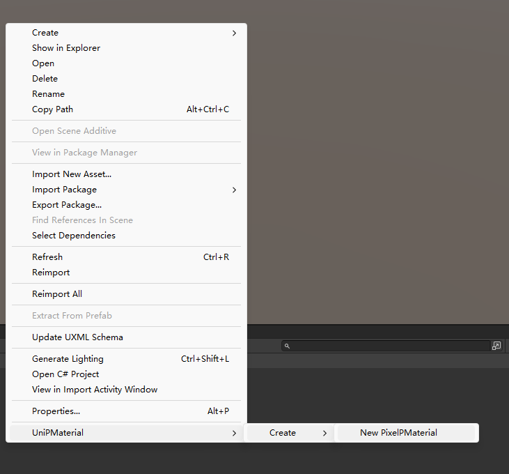
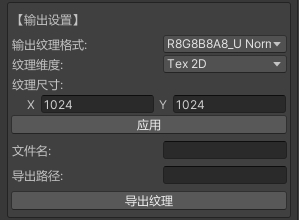
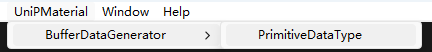

# Unity Procedural Painter

以前写过不少小工具来处理工作中碰到的需要用shader处理一些纹理的需求。但仔细想想很多工具都有点重复造轮子，而且有时候需要多个工具来处理的时候实在是不方便，这次就索性写个通用的程序化处理纹理的工具，也就是Unity Procedural Painter(后文也记为PMaterial或更简单的PMat)。



PMat支持以下材质属性作为可配置的(也是可序列化下来的)属性:

- `Int`
- `Float`(不支持`Range`，虽然要支持也不是不行，等上TODO List吧)
- `Color`
- `Vector`
- `Texture`: 包括`Texture2D`, `Texture3D`, `Cubemap`以及有条件的`RenderTexture`(详见后文)
- `ComputeBuffer`: 没错, 这也是为什么我要做个PMat而不直接用Material来做

理论上要让矩阵作为PMat的属性也不是不行，不过这玩意理论上也是可以用`ComputeBuffer`来做的(主要是Editor GUI没有现成的足够好的容器来记录矩阵)，因此就暂时不上TODO List了。

# 如何使用

## 创建PMat

点击鼠标右键, 拉到最底下并选择`UniPMaterial/Create/New PixelPMaterial`来新建PMat。



一旦创建了一个PMat，就会基于其你给PMat取的名字创建一个关联的Shader文件。需要注意的是，这个自动创建的Shader是不允许修改文件名的(我做了限制，虽然限制修改文件名在当前并没有实际意义)，不过是可以修改shader的path的名字的(也就是`Shader.Find()`中的`name`参数，在有歧义的情况下我喜欢叫这个为path name)。

你可以双击PMat的资源来打开PMat的属性编辑面板，当然，也可以点击shader文件来编写代码。不过当前的PixelPMaterial是不支持修改vs的(因为是全屏的)，只支持修改ps。

## PMat编辑面板

首先是PMat的输出的设置。PMat总是有个输出的纹理，是一个`RenderTexture`，不过我给这个封装了一下，叫`RTHandle`(和一些版本的URP里的一样)，



虽然提供了纹理维度为`Cubemap`的选项，不过当前实现的就只有`Tex2D`的。纹理尺寸并不需要一定是2的幂次的，可以是任意大于等于1的值(当然，存在上限，一般是16384)。

PMat中的属性是基于用户在shader中声明的来确定的。需要注意的是，我们称shader中的`Properties{}`块中声明的叫shader的material properties，称在shader的Pass中或是CGINCLUDE中声明的为shader的shader properties(当然，unity的api文档中经常称我们叫的material properties为shader properties，这是很有歧义的，而且从一些api的功能上来说官方的一些称法也是不太合理的)。我们识别PMat中的属性是通过material properties以及一个特殊格式的注释来识别的(Compute Buffer的声明在后文会提到)，因此仅在shader properties中声明的变量通常是无效的。

## 嵌套PMat

上面我们说了每个PMat都是有个`RTHandle`作为"输出"的，因此(PMat)也可以作为PMat中`Texture`属性的输入来源，也即PMat嵌套。但是显然这种嵌套是有规则的，即满足类似集合的正则公理的约束：不能有无穷下降链。显然，PMat不能自己套自己，否则在管线中，没有渲染的"起点"，同时也不应该有过多的嵌套，否则一旦出现更新其中一个嵌套的就会产生巨大的资源开销(没办法，我水平太低)。因此我采用了非常无情的办法：只允许嵌套一层，也即一个PMat中如果要用另一个PMat作为纹理输入，那么作为输入的PMat中是不允许有以PMat为纹理的输入的纹理的。

详见`Assets/UniProceduralPainter/Samples/Multiple`中的示例。

## Compute Buffer数据源

当前我们就提供了一种处理Compute Buffer数据源的工具



需要知道的是，我们反序列化后的数据类型是`uint`的，因此如果源数据是`float`等其它类型的，则需要在shader中用`asfloat()`等方法自行转换一下。

我们通过如下格式在shader文件的最后面来声明Compute Buffer，

```
/*PROPBEGIN
* Buffer: Name=Buffer1名; Desc=描述1; Stride=struct1的大小;
* Buffer: Name=Buffer2名; Desc=描述2; Stride=struct2的大小;
PROPEND*/
```

此外我们支持使用多个Compute Buffer作为属性。

详见`Assets/UniProceduralPainter/Samples/Buffer`中的示例。

## Preview操作

在Preview面板中，可以通过按住鼠标中间来拖动纹理，通过滚轮来放大缩小纹理。当然，也可以通过修改左侧的预览参数来修改放大缩小的比例。


# TODO List

- 实现PMat的pipeline的更新: 当前未实现, 因此将纹理改为`RTHandle`为输入的时候会不更新, 需要关掉重新打开。
- 修改导出纹理的方案。
- 实现Compute Shader的PMat。
- 实现PMat输出格式为`Cubemap`的功能。
- 实现提取网格数据按照指定格式生成`ComputeBuffer`数据源的工具。
- 实现给PMat重命名的功能。
- 实现支持`ComputeBuffer`作为属性输入的，支持一些特殊的vs的PMat。
- 实现一些常用的预制好的PMat整合工具。
- 实现基于PMat的批处理的工具，比如利用指定PMat来处理一堆纹理。